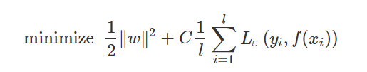

**Introduction**

As the rapid development of the society, transportation has been an indispensable part of human activities. However, some of the developing countries are facing with problems in constructing transportation systems. To improve the systems, intelligent transportation system has been developed and represent the future direction of the transportation system. Also, intelligent transportation systems also start looking at Big Data with great interests because of the success of big data analytics in various field. In this article, I will look at how Support vector machine (SVM) works in process of transportation development and evaluate their values.

**Problem statement** 

Some transportation problems exist that may harm individual people from different perspectives. Congestions on the road may lead to restrictions on car use in some urban areas, which limits people’s choices in transportation. There’s also an increasing accident risks interacting with the congestion, which threatening people’s lives. Also, there can be lack of access to modern world in mountain areas and limited land resources that prevent cities from building new infrastructure such as highways and freeways. Though large percentages of some developing countries’ total expenditures are spent on transportation system, the situation has not been improved for several years. Incomplete ITS theory, insufficient research and the separated resources by industry barriers may be one of the reasons why traffic problems persist.

**SVM in traffic incident detection**

Support vector machine (SVM) is a popular supervised learning algorithm in machine learning that use labelled data for regression and classification. When people were trying to make precise traffic incident detection, SVM was introduced and applied after artificial neural networks was found to have a defect that limits its wide application. Traffic incidents are defined as nonrecurring events such as accidents, disabled vehicles, temporary maintenance and construction activities, etc. As the rapid development of road infrastructure construction of China, the number of vehicle and highway mileage keep increasing along with frequent traffic incidents. People want to focus on improving the ability of forecasting the development trend of traffic fatality under existing road traffic conditions because if the incident cannot be handled in time, it will increase traffic delay, reduce road capacity, and often cause second traffic accidents. We neither want congestion to reduce the efficiency of the transportation system nor more accidents which threaten personal safety and may even hurt people’s lives. In order to construct a more efficient and safe transportation system, timely detection of incidents is critical.

**SVM**

SVM is a kind of supervised learning model based on statistical learning theory that is trying to minimize risk and be accurate. It is a fairly mature method in small sample situation and has a better generalization ability to solve machine learning problems in classification and induction. One of the advantages of SVM is that it does not get trapped in a local optimum, which means SVM do not need to perform complex nonlinear optimization and not fall into local optima because of its global optimal characteristics. To further explain that, the corresponding kernel function is defined when solving the nonlinear operation to greatly simplify the calculation. SVM maps the data in the nonlinear low-dimensional space into linear high-dimensional space, and transfers the search for the optimal linear regression hyperplane algorithm into solving convex programming problem under convex constraint, so as to get the global optimal solution. Following are some mathematics equations to represent the function approximately.

Given a set of data points (x1, y1), (x2, y2), …, (xl, yl )(xi∈ X⊆ Rn, yi∈ Y⊆R, l is the total number of training samples) randomly and independently generated from an un- known function, SVM approximates the function using the following form:
f(x)=w⋅ϕ(x)+b (1)

In the case of predicting traffic incidents, x is the input that consists of the values of the traffic flow parameters such as volume, speed, occupancy and so on, and y represents the class label of x. In the equation above, ϕ(x) represents the high-dimensional feature spaces which is nonlinearly mapped from the input space x. ω represents the weight vector and b represents the offset value, both of them are estimated by minimizing the regularized risk function:

 (2)
