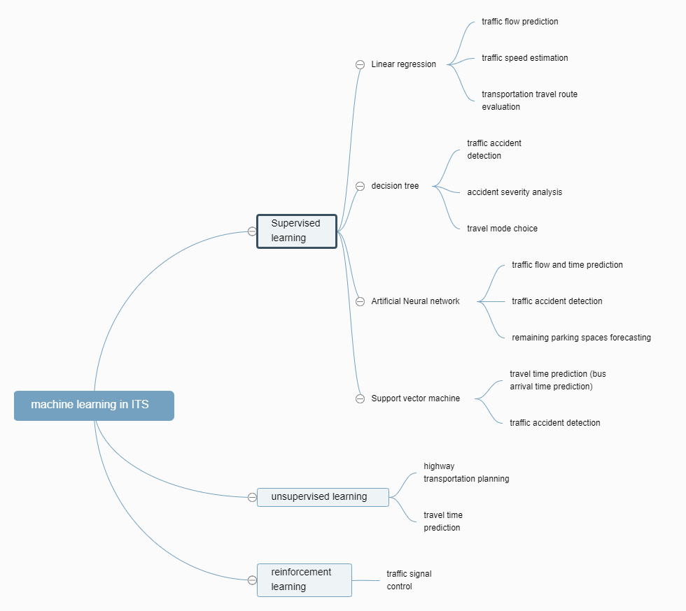

**Big data methods in solving transportation problems in China**

Jingwen Yao

**Abstract**

The purpose of this article is to explore how big data methods in intelligent transportation system help to solve traffic problems in China. The article begins with introducing the current transportation problems that many developing countries are faced with and talking about the necessity of utilizing technology in practice. Then the article mentions current situation in China and the problems and challenges that the development of ITS in China is faced with. Aware of the significance of solving transportation problems using ITS, I talked about how and what kind of big data is collected- big data collected from smart cards, GPS, sensor equipment and some other social transportation data. With all kinds of data collected, big data analytic method—machine learning—is also introduced. 

**Background**

In today’s world, solving transportation problems has been one of chief tasks confronting governments in developing countries since transportation directly contributes to the economic growth and specialization associated with urban areas. More importantly, transportation facilities expand the options for work, education, health, and other amenities and directly affect the economic efficiency of cities and the well-being of their inhabitants. However, because of the limited amounted of resources developing countries owned, how to provide their citizens with minimal transportation facilities becomes a critical question to the government. Despite the fact that ranging from 15 to 25 percent of some developing countries’ total expenditures is spent on transportation system, the current situation even seems to get worse. [1] In China, comparison between the length of highways and the number of privately owned vehicles shows that the road transportation network in China is increasingly suffering from overcrowding, leading to decreasing satisfaction among road users. The government always want to formulate effective road projects in order to improve traffic situations, which is hindered by the lack of empirical data of actual road conditions. To solve this problem, intelligent urban transportation technology such as road monitoring, speed cameras, automatic toll gates are used. According to statistics from the China Urban Intelligent Transportation market research report, the compound annual growth rate of urban intelligent transportation between 2008 and 2013 was 20.2 percent.[2]

**Current situation in China**

Transportation has been an indispensable part of human activities. Research shows that subjective well-being of residents could be influenced by commute time-- the longer the commute time, the lower the subjective well-being. [3] In China, following transportation problems exist. 
First, congestion has become an increasingly important issue as the number of vehicles on the road increases. In Beijing, 800,000 more vehicles were added in 2010 with four million at the beginning of that year. Congestion can lead to an increase in environmental pollution like fuel and, air and difficulties in implementing plans for public transportation as well. Second, accident risks increase with the expansion number of vehicles on the roads in China. Researches showed that almost three fourths of all traffic accidents can be attributed to human error. The reports published by the U.S. Federal Highway Administration indicated that 50%–60% of all congestion delays are caused by traffic accidents that happened in cities. Undoubtedly, the government wants to reduce the number of traffic accidents and minimize its following impact. Third, land resources are often limited in China, which makes it difficult to build new infrastructure such as highways and freeways. 

The government have put some effort into solving these problems. For example, during Beijing Olympics in 2008, the Beijing government imposed a restriction on car owners based on odd/even license plate numbers to keep nearly half of private cars off the road. This approach is definitely useful to reduce congestion and pollution. However, it’s only serves as a last resort and cannot be used in the long term. Another strategy is to add additional infrastructure and improve the existing infrastructure. The government may decide to construct new roads or widen the current roads, which can be costly and demanding for the use of already very limited land resources. The third strategy is to improve the use of the existing transportation system. We can analyze the data that are collected from large amounts of auxiliary instruments, like smart card, Global Positioning System (GPS), all kinds of sensors etc. that I will mention below. Nowadays, data can not only be processed into useful information but can also be used to generate new functions and services in intelligent transportation systems (ITS). For example, GPS data can be utilized to analyze and predict the behavior of traffic users, which is a function that is not fully utilized in conventional ITS. [4]

At present, there are still several problems and challenges that limit the development of ITS in China. Such as the ITS theory is incomplete, research is insufficient and the resources are separated by industry barriers. [5] China still has a long way to go in fully utilizing ITS to solve transportation problems for the country and we should keep researching in this field. 

Research has shown that traffic congestion in Beijing has reduced the municipal gross domestic product by 4-7 percent and commuting mode choice significant influence subjective well-being. [3] The former one reminds us the economic gain that may come together with the improvement in transportation system, and the latter one cares about personal satisfaction towards life, which may be a higher level of freedom, similar to what Amartya Sen have mentioned. Improving in the problem of long commuting time, after all, is to optimize our transportation system, which will lead to not only a more efficient society with higher level of total output, but also a more satisfying country that provide the residence with more freedom. Because of the large population in China, the process of development in transportation should be done step by step to adapt to the specific condition. Considering the current situation, study and application of ITS in China is now in urgent need.

**Big data collection in transportation**

Recently, Big Data has become a hot topic in lots of industries and seems to become a future trend. Big Data analytics are used in various fields, like business, social network and smart grid, and have achieved great success. As a result, intelligent transportation systems also start looking at Big Data with great interests. Intelligent transportation systems (ITS) have been developed since the beginning of 1970s and represent the future direction of the transportation system. ITS incorporate advanced technologies which include electronic sensor technologies, data transmission technologies, and intelligent control technologies into the transportation systems. ITS aims at providing services for drivers and riders in transportation systems to make their lives more efficient and convenient. Nowadays, as the rapid development of sensing, computing, and networking techniques, data is collected and applicated in ITS all the time when people are even unaware of. The technology development in ITS has led to an increase in the complexity, diversity and amount of data created and collected from vehicle, and people movements. According to different sources in ITS, Big Data in ITS can be simply categorized into the several types following.

The first type of source in ITS is big data collected from smart cards which aims at investigating the passengers’ movement patterns. In Automatic Fare Collection systems passenger always use smart cards when they take buses or subways. Then, passenger’s transport information such as boarding time, OD information will be captured by electronic readers when smart cards are touched. Smart cards in AFC systems generate huge amount of data records every day in big cities in China like Beijing and Shanghai. GPS is another type of data which people are very familiar with in location tacking. Traffic data can be collected more efficiently and safely with location tracking via GPS. Combining geographic information system (GIS) or other map displaying technologies, GPS provides a promising tool for data collection, and the collected data can be used for addressing many traffic issues, such as travel mode detection, travel delay measurement and traffic monitoring. Similarly, data such as vehicle speeds, vehicle density, traffic flows, and trip times are also collected by sensor equipment installed in ITS. Data collection from sensors can be divided into three sources: roadside data, which refers to the data collected by sensors located along roadside; floating car data, which refers to the vehicle mobility data at different locations in ITS, where customized detectors are embedded in vehicles; and wide area data, which refers to the wide area traffic flow data.[6] Besides those data collected from technological equipment, social transportation data collected mostly from mobile phones are also useful in certain researches. The mobile phone data which include accurate location of people’s home, work, entertainment locations for a large fraction of residents are always used for estimating travel demand and providing information flows between providers and consumers in real time. 

Each type of data is able to record at least one aspect specific to human mobility, or information of a person or a community and different types of transportation data are suitable for solving different problems. As a result, the data fusing approaches and techniques are needed here. By utilizing various kinds of transportation data, people are able to make more precise prediction, improve the algorithm performance and many other things. [7]

**Big Data Analytics Methods**

Machine learning is one of the most popular modelling and analytics theory in Big Data ecosystems, which aims at deriving patterns and models from large amount of data. In the ITS areas, machine learning theory has also been widely used to conduct data analytic. Depending on the completeness of data set that is available for learning, Machine learning models can be categorized into supervised, unsupervised and reinforcement learning algorithms. Besides that, the powerful deep learning models have also been introduced to ITS because of the development of Artificial Intelligence. But here, we may focus on the former three categories.[6] 

First, Supervised learning is the machine learning task of learning a function that maps an input to an output based on example input-output pairs. It infers a function from labeled training data consisting of a set of training examples.[8] Combined with the learned model and the input data, the unseen outputs can be predicted. Among all the supervised learning models, linear regression, decision trees, neural networks, and support vector machines, are the most frequently used in ITSs.[6] 
Linear regression explains the relationship between one dependent variable and one or more independent variables in the most simple, robust way, which is easy to code and interpret. Despite its simplicity, linear regression is particularly successful in various ITS scenarios, such as traffic flow prediction, traffic speed estimation, and transportation travel route evaluation. A decision tree is a decision support tool that uses a tree-like graph to model decisions and their possible consequences. Due to their portability, robustness and transparency, decision trees are widely used in various ITS scenarios, such as traffic accident detection, accident severity analysis and travel mode choice. Other than linear regression, there are many other relationships that cannot be explained. Artificial Neural network (ANN) is a popular example of supervised learning for learning non-linear regression with its strong ability to processing data. As a data modeling tool, it has also been adopted in ITS such as traffic flow prediction, travel time prediction, traffic accident detection and remaining parking spaces forecasting. Support vector machine (SVM) is another popular supervised learning algorithms that use labelled data for regression and classification. It has been successfully used in travel time prediction, bus arrival time prediction, and traffic accident detection. 

Second, unsupervised learning is a machine learning technique in which the users do not need to supervise the model. Instead, it allows the model to work on its own to discover patterns and information that was previously undetected. It mainly deals with the unlabeled data. K-means is the most popular unsupervised learning tool, and it has been widely adopted in highway transportation planning, and travel time prediction.

Third, reinforcement learning aims at minimizing the long-term cost through exploration and learn the optimal policy by interacting with the experimental data. It is highly relevant to control and optimization theory, and it has been proved to be quite feasible in traffic signal control in ITS. After a series of calculation of the action-value function and sufficiently learned by the model, the optimal policy of reinforcement learning can be determined by selecting the action with the highest ‘reward’ value, which could help people to find the best results in different transportation designs. [6]

**Conclusion**

Reflecting on this article, the transportation problem that the article aims at solving is a little too board. During researching, I found that there have not been much articles that talks about the specific case that use big data methods to solve a certain transportation problem in China. To further research on this topic, looking for more detailed process how the previous problems are solved might be a good idea. Besides, narrowing the scope of the ‘problem’ into more specific ones like reducing congestion in urban areas with controlling real-time changes of traffic lights or predicting traffic flows is what I’m thinking about.    

[1] Khisty, C Jotin. Transportation in Developing Countries: Obvious Problems, Possible Solutions. Transportation Research Record No.1396, (1993): 44

[2] R. P. Biuk-Aghai, W. T. Kou and S. Fong, “Big data analytics for transportation: Problems and prospects for its application in China,” 2016 IEEE Region 10 Symposium (TENSYMP), Bali, Indonesia, 2016, pp. 173-178, doi: 10.1109/TENCONSpring.2016.7519399

[3] Zhu, Zhenjun, Zhu, Zhenjun, Li, Zhigang, Li, Zhigang, Chen, Hongsheng, Chen, Hongsheng, Liu, Ye, Liu, Ye, Zeng, Jun, and Zeng, Jun. “Subjective Well-being in China: How Much Does Commuting Matter?” Transportation (Dordrecht) 46.4 (2019): 1505-524. Web.

[4] J. Zhang, F. Wang, K. Wang, W. Lin, X. Xu and C. Chen, "Data-Driven Intelligent Transportation Systems: A Survey," in IEEE Transactions on Intelligent Transportation Systems, vol. 12, no. 4, pp. 1624-1639, Dec. 2011, doi: 10.1109/TITS.2011.2158001

[5] Huang, W., Wei, Y., Guo, J. et al. Next-generation innovation and development of intelligent transportation system in China. Sci. China Inf. Sci. 60, 110201 (2017). 

[6] L. Zhu, F. R. Yu, Y. Wang, B. Ning and T. Tang, "Big Data Analytics in Intelligent Transportation Systems: A Survey," in IEEE Transactions on Intelligent Transportation Systems, vol. 20, no. 1, pp. 383-398, Jan. 2019, doi: 10.1109/TITS.2018.2815678.

[7] [4] X. Zheng et al., "Big Data for Social Transportation," in IEEE Transactions on Intelligent Transportation Systems, vol. 17, no. 3, pp. 620-630, March 2016, doi: 10.1109/TITS.2015.2480157.

[8] Wikipedia: supervised learning
