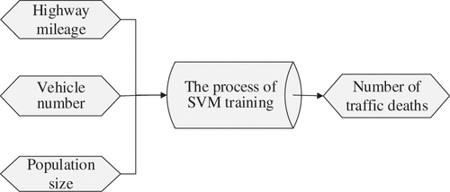

**Introduction**

In today’s world, solving transportation problems has been one of chief tasks confronting governments in developing countries since transportation directly contributes to the economic growth and specialization associated with urban areas. In China, there are many kinds of transportation problems exist, like congestions in urban areas and limited land resources that make it difficult to build new infrastructure such as highways and freeways. Here, what I’m going to focus on is relatively high rate of traffic accidents on the road. 

In recent years, the vehicle number and highway mileage are increasing rapidly along with the continuous improvement of road infrastructure construction in China. This has contributed to the economic development but also had some negative effects: frequent road traffic accidents. Some reports indicated that 50%–60% of all congestion delays are caused by traffic accidents that happened in cities. Beyond congestions, the harm of traffic fatality to social life is extremely serious. It is always threatening our personal safety and has become a serious social problem, which is worthy of our attention. However, one characteristic about traffic fatality is that it has strong randomness. The randomness is influenced by the factors such as driver and passenger characteristics, vehicle types, traffic conditions, and geometric design characteristics. Nevertheless, it is difficult for us to figure out the complex relationship between traffic fatalities and various influencing factors since it is nonlinear. Also, as the various factors influence each other, it is difficult to use a single factor to explain traffic fatalities. Therefore, what I want to research about is to summarize and analyze the traffic safety data, find out the inherent laws of traffic fatality and be able to predict specific cases in the future. It is of practical significance to forecast the development trend of traffic fatality under existing road traffic conditions, and it provides the basis for further formulating the road traffic safety plan or making the decision.

**Solution**

Support vector machine (SVM) is a popular supervised learning algorithm in machine learning that use labelled data for regression and classification. When people were trying to make precise traffic incident detection, SVM was introduced and applied after artificial neural networks was found to have a defect that limits its wide application. Traffic incidents are defined as nonrecurring events such as accidents, disabled vehicles, temporary maintenance and construction activities, etc. As the rapid development of road infrastructure construction of China, the number of vehicle and highway mileage keep increasing along with frequent traffic incidents. People want to focus on improving the ability of forecasting the development trend of traffic fatality under existing road traffic conditions because if the incident cannot be handled in time, it will increase traffic delay, reduce road capacity, and often cause second traffic accidents. We neither want congestion to reduce the efficiency of the transportation system nor more accidents which threaten personal safety and may even hurt people’s lives. In order to construct a more efficient and safe transportation system, timely detection of incidents is critical.

The reason why we choose SVM as the method is because SVM is a kind of supervised learning model based on statistical learning theory that is trying to minimize risk and be accurate. It is a fairly mature method in small sample situation and has a better generalization ability to solve machine learning problems in classification and induction. One of the advantages of SVM is that it does not get trapped in a local optimum, which means SVM do not need to perform complex nonlinear optimization and not fall into local optima because of its global optimal characteristics. To further explain that, the corresponding kernel function is defined when solving the nonlinear operation to greatly simplify the calculation. SVM maps the data in the nonlinear low-dimensional space into linear high-dimensional space. At the same time, instead of searching for the optimal linear regression hyperplane algorithm SVM is trying to solve convex programming problem under convex constraint, so as to get the global optimal solution.

In order to improve urban transportation, we are trying focus in achieving a comprehensive assessment of traffic accidents. There are three principles that the choice of relevant indicators should follow– representation, testability, and comparability. When thinking of the construction the traffic system, people, vehicle and road are three basic factors that need to be considered. And we know that traffic accidents often happen randomly because of a variety of quantitative factors and qualitative factors. From the literature on traffic accident prediction, we know that there are also some other impact factors such as highway mileage, vehicle number, lane width, average daily flow, and population. The combination of these many factors including person, vehicle and road, highway mileage, vehicle number, population size, led to the occurrence of traffic accidents. For the output variable, we could compare the traffic fatality with the known real data for accuracy since traffic fatality is too serious to be neglected in real life. Furthermore, according to previous research, the current widely used indicators of traffic accidents are the number of traffic fatalities, the number of injuries, the number of road traffic accidents and economic losses. Here we select the most comparable traffic accident deaths as predictor index because there is no uniform statement about the definition of injury. Finally, we get the traffic accident prediction model shown below.

**Research objective and comparison**

The aim of the research is to optimize the traffic accident prediction model so that the model can be actually used to reduce traffic fatalities and lower the traffic death rate in people’s daily life. The first step of utilizing a new modelling is to make it as accurate as possible and that is what SVM is doing here. What I expected is to gain from the model is to be able to monitor the possibility of road accidents in real time and then adjust the volume of traffic flows in order to reduce the possibility of accidents. Besides that, with all the data collected from the model, Road infrastructure safety improvements can also be made.

Road users are not less or more responsible on different road types, but road risks differ markedly, dependent on the traffic complexity created by the road type and its allowed road modes. Some research showed that speed kills are not primarily, because data indicated that the lowest fatality risks are in traffic calming areas and on motorways. On these road types, the speed deviations among its road users are proportionally smaller than on other road types. The injury risk is highest on roads where relatively high differences in speed and direction are present in combination with moderate speed limits (50 or 70 km/h limit, mixed slow and fast traffic, level crossings, opposite traffic). The fatality risk is highest where also the speed limits are inappropriately high (like the 80 or 100 km/h limits on roads with mixed traffic, level crossings, and opposite traffic without mid barriers) Clearly the infrastructure design and traffic rules of roads determine the traffic complexity for its road users and, thereby, also the risk differences between road types. These differences are mainly explained by effects of different average impact speeds in crashes, especially in crashes with pedestrians or cyclists, and by effects of speed differences on crash frequency.

Compared with road infrastructure safety improvements, the advantage of the traffic fatality prediction model is that it can directly reduce the fatality rate on existing roads and it has flexible real-time performance. If the model is successfully applicated, immediate decrease in fatality rates is expected. In the contrast, it may take the infrastructure design and traffic rules of roads longer time to see actual benefit. 

**Possible problems and solutions**

As mentioned before, SVM is a theory of machine learning law in small sample situation and it can handle the small sample and nonlinear problems effectively, especially in terms of prediction. However, the selection of parameters has a strong subjectivity in the learning process of SVM, which seriously restrains the accuracy and effect of SVM prediction. The value of two variables, penalty factor c and kernel parameter σ are influencing the prediction accuracy of SVM. As a result, what we want improve here is to find the optimal c and σ. At present, these parameters are subjective because they are usually defined artificially based on the specific issues, and the optimal parameter combination is determined by selecting the parameters for several times and comparing with each other. Because of the blindness and low efficiency of parameters that are manually set, adopting swarm intelligence optimization algorithm to improve the parameter choosing of the SVM may be a good idea. At the same time, the design and implementation of particle swarm optimization (PSO) algorithm is relatively simple. Not only the convergence speed is fast, but also the parameters required to be set are less. 

PSO algorithm is a kind of population intelligence algorithm proposed on the basis of studying the behavior of birds and fish. The idea comes from the concept of artificial life and evolutionary computation that it imitates the foraging behavior and achieves the optimal group through the bird collective collaboration.
The PSO algorithm is a global search strategy that uses the simple operation of the v–s model, comparing with the evolutionary computation. PSO has unique memory mechanism, thus it can adjust the search strategy by keeping track of the current search based on real time, which is what the fatality model can take advantage of. At the same time, it exists some limitations of stagnation due to the parameter setting requirements of PSO algorithm. Therefore, to further expand the solution space and improve the prediction accuracy of SVM, the mutation operation of GA is introduced into PSO for predicting SVM parameters.

**Budget**

Finally, when considering a $100,000 budget as the limit for one-year exploratory phase, the first thing to mention is to spend the money in promoting the practical application of the traffic fatality model. The model is supported by all kinds of data like highway milage, real-time vehicle number and population size etc. and these data must be collected by sensors that installed on or near the road. Besides that, we also need to identify the cities and roads that we choose as our experimental sites. Thus, an estimated amount of $35,000 have to be spent on purchase, installation and maintenance of the data sources and $25,000 would be used to obtain permissions from governments on China since the requirement for those data might be refused if it may threaten public’s privacy. For the rest $40,000, half of which is expected to pay for the scientists that are working for collecting actual data on roads and applicate the fatality prediction model to see how effective the model is. Another $20,000 will be paid to another group of scientists whose efforts are made to deepen and improve the SVM model for accuracy. 

Reference:

